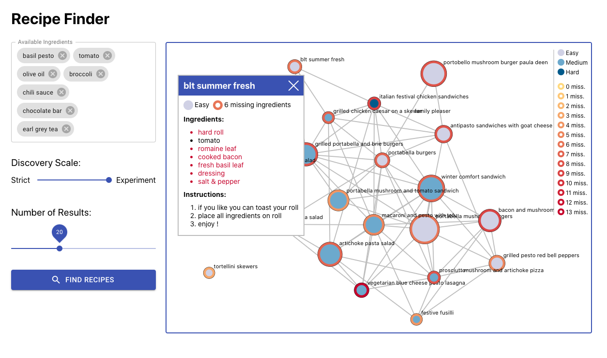

# Team 145 - Pamplemousse - Final Project


## Overview

This application is a food recipe search engine that allows casual cooks to
easily find recipes for ingredients that they already possess, and are also
willing to experiment with recipes to substitute any missing ingredients with
alternatives from their own pantry.



## Package Description


This package includes all the code necessary to replicate the project, as
well as the associated project documentation and poster. Main components are
described below:

 - CODE:
    - Contains all the source code of the project
 - CODE/backend:
    - The backend engine that serves the front-end through HTTP API. This
contains both the Flask server and database access layer.
 - CODE/backend/modeling:
    - Contains code to generate model embeddings thare used by the search
      engine
 - CODE/data-prep:
    - contains code, and instructions to pre-process the dataset
 - CODE/environment:
    - Describes the necessary environment to run the application
 - CODE/supplementary:
    - Contains supplementary code/content used in project/docs
 - CODE/web-app:
    - Contains the React based front-end application in JavaScript
 - DOC:
    - Contains the project report and poster PDFs.


## Usage Instructions

The overall workflow is simple, all you need to provide is a list of
available ingredients, and search. The available controls allow you to show
search results from direct matches to more lenient substitutions. Also
another control allows you to control the quantity of returned results.

The recipe display area shows the search results as a network graph, where
you can inspect individual recipes.

Available workflows include the following:

1. Start a search of recipes by specifying ingredients that you currently have

    a) Each ingredient must be recognized by the application. Ingredients not recognized are currently not supported

2. Once all available ingredients have been specified, press Find recipes

3. Search results appear in the graph view. The legend explains the colors,
   and shapes.

    a) Each recipe node is colored based on difficulty of recipe for a casual cook

    b) Each recipe node has a border indicating the number of recipes that the system substituted

    c) The size of the recipe node indicates the closest match to your ingredients input

4. Click on a recipe node to show its details.


Instructions to Run Source Code
===============================

There are several options to run the application locally. However, all
options listed below depend on the online database server hosted on Microsoft
Azure Cloud Computing Services at:
dva-pamplemousse.postgres.database.azure.com

Your computer must be able to access this server. These options were tested
on a clean Ubuntu 20.04 64-bit installation.


Using a Docker Container
========================

Follow these:

1. Install Docker software, if you do not have one installed.
Open a terminal, and run the following commands:
```sh
sudo apt-get update
sudo apt install apt-transport-https ca-certificates curl software-properties-common
curl -fsSL https://download.docker.com/linux/ubuntu/gpg | sudo apt-key add -
sudo add-apt-repository "deb [arch=amd64] https://download.docker.com/linux/ubuntu focal stable"
sudo apt update
sudo apt -y install docker-ce
```
For more details, see [this](https://www.digitalocean.com/community/tutorials/how-to-install-and-use-docker-on-ubuntu-20-04):


2. Pull the docker image for the app and open a terminal and run the following commands:
```sh
sudo docker login
sudo docker pull <REGISTRY>/dva-recipe-app
```

3. Run the docker image
```sh
# Note: The docker image requires at least 2GB of RAM
sudo docker run -d --name recipe-app -p 80:80 <REGISTRY>/dva-recipe-app
# To stop the app, use:
sudo docker stop recipe-app
```

4. Open in browser and navigate to `localhost`


## Build Docker image


Here are the commands to build the docker image:
```sh
cd <app-extracted-dir>/CODE/
mkdir backend/modeling/outputs
cd supplementary; unzip 19321120.zip; mv 19321120 ../backend/modeling/outputs/ ; cd ..
sudo docker build -t wiki1677/dva-recipe-app:<TAG> -f environment/Dockerfile .
```

## Run Flask Application Manually
The application can be run manually as well by following the instructions
below. Note that all commands are expected to be run in the default terminal
shell. Also <app-extracted-dir> is the path to the directory where this
package was extracted.

1. Install Python 3.7, and requirements

    a) Install Python 3.7
    ```sh
    sudo add-apt-repository ppa:deadsnakes/ppa
    sudo apt update
    sudo apt -y install python3.7 python3-pip python3.7-venv
    ```
    b) Create a virtual environment
    ```sh
    cd <app-extracted-dir>/CODE
    python3.7 -m venv .venv
    .venv/bin/activate
    ```
    c) Install required modules
    ```sh
    pip install -r environment/requirements.txt
    pip install torch==1.7.0+cpu torchvision==0.8.1+cpu torchaudio==0.7.0 -f https://download.pytorch.org/whl/torch_stable.html
    ```

2. Install Node.js 15.x

   ```sh
   curl -sL https://deb.nodesource.com/setup_15.x | sudo bash -
   sudo apt install -y nodejs`
   ```

3. Build front end application
  ```sh
  cd <app-extracted-dir>/CODE/web-app
  npm install
  npm run build
  ```

3. Unzip model files. `app-extracted-dir` is the directory this package was extracted to:
    ```sh
    cd <app-extracted-dir>/CODE/
    mkdir backend/modeling/outputs
    cd supplementary; unzip 19321120.zip; mv 19321120 ../backend/modeling/outputs/ ; cd ..
    ```

4. Run flask:
    ```sh
    cd <app-extracted-dir>/CODE
    # Create .env file using environment variables defined in  <app-extracted-dir>/CODE/environment/Dockerfile
    # Edit <app-extracted-dir>/CODE/backend/routes.py and fix the path in model_path variable
    flask run -p 8080
    ```
    Open web browser and go to `localhost:8080`


## Prepare Dataset, and Create Database
Please follow the instructions in `<app-extracted-dir>/CODE/data-prep/instructions.txt` to download the dataset, and set up the database. This directory also includes the open-refine project
to clean ingredients data.

Generate Model Embeddings
=========================

To generate model embeddings, follow the steps below:

1. Create a `.env file` based on environment defined in
   `<app-extracted-dir>/CODE/environment/Dockerfile`
2. Place the `.env` in `<app-extracted-dir>/CODE/backend/data_munging` directory
3. `cd <app-extracted-dir>/CODE/backend/modeling/`
4. `PYTHONPATH=.. python3.7 train_model.py`
